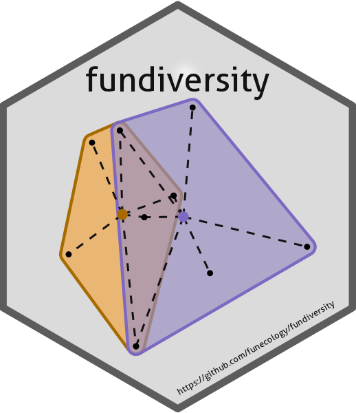

<!-- README.md is generated from README.Rmd. Please edit that file -->

```{r, include = FALSE}
knitr::opts_chunk$set(
  collapse = TRUE,
  comment = "#>",
  fig.path = "man/figures/README-",
  out.width = "100%"
)

temp_dir = tempdir(check = TRUE)

pkg_has_vignettes_and_test = function(pkg_name, pkg_dir = temp_dir) {
  pkg_archive = download.packages(pkg_name, destdir = pkg_dir,
                                  repos = "https://cran.r-project.org")
  
  files_list = untar(pkg_archive[1, 2], list = TRUE)
  
  has_vignette = paste0(pkg_archive[1, 1], "/vignettes/") %in% files_list

  has_tests = paste0(pkg_archive[1, 1], "/tests/") %in% files_list

  c(ifelse(has_vignette, "✅", "❌"), ifelse(has_tests, "✅", "❌"))
}
```

# fundiversity 


<!-- badges: start -->
[](https://lifecycle.r-lib.org/articles/stages.html#stable)
[](https://github.com/funecology/fundiversity/actions)
[](https://app.codecov.io/gh/funecology/fundiversity)
[](https://CRAN.R-project.org/package=fundiversity)
[](https://zenodo.org/badge/latestdoi/300231216)
<!-- badges: end -->

`fundiversity` provides a lightweight package to compute common functional
diversity indices. To a get a glimpse of what `fundiversity` can do refer to the
[introductory vignette](https://funecology.github.io/fundiversity/articles/fundiversity.html).
The package is built using clear, public 
[design principles](https://funecology.github.io/fundiversity/articles/design-principles.html)
inspired from our own experience and user feedback.

## Installation

You can install the stable version from CRAN with:

```{r, eval = FALSE}
install.packages("fundiversity")
```

Alternatively, you can install the development version with:

```{r eval = FALSE}
install.packages("fundiversity", repos = "https://bisaloo.r-universe.dev")
```

## Examples

`fundiversity` lets you compute six functional diversity indices: Functional Richness with `fd_fric()`, intersection with between convex hulls with `fd_fric_intersect()`, Functional Divergence with
`fd_fdiv()`, Rao's Quadratic Entropy with `fd_raoq()`, Functional Dispersion with `fd_fdis()` and Functional Evenness with `fd_feve()`. You can have a brief overview of the indices in the [introductory vignette](https://funecology.github.io/fundiversity/articles/fundiversity.html).

All indices can be computed either using global trait data or at the site-level:

```{r example}
library("fundiversity")

# If only the trait dataset is specified, considers all species together
# by default
fd_fric(traits_birds)

# We can also compute diversity across sites
fd_fric(traits_birds, site_sp_birds)
```

To compute Rao's Quadratic Entropy, the user can also provide a distance matrix between species directly:

```{r rao-distance-matrix}
dist_traits_birds = as.matrix(dist(traits_birds))

fd_raoq(traits = NULL, dist_matrix = dist_traits_birds)
```

## Function Summary

```{r child="man/rmdchunks/_fundiversity_functions.Rmd"}
```

## Parallelization

Thanks to the `future.apply` package, all functions (except `fd_raoq()`) within `fundiversity` support parallelization through the `future` backend. To toggle parallelization follow the [`future` syntax](https://cran.r-project.org/package=future):

```{r future-syntax, render=FALSE}
future::plan(future::multisession)
fd_fdiv(traits_birds)
```

For more details please refer to the [parallelization vignette](https://funecology.github.io/fundiversity/articles/fundiversity_1-parallel.html) or use `vignette("fundiversity_1-parallel", package = "fundiversity")` within R.

## Available functional diversity indices

According to Pavoine & Bonsall (2011) classification, functional diversity indices can be classified in three "domains" that assess different properties of the functional space: richness, divergence, and regularity. We made sure that the computations in the package are correct in our [correctness vignette](https://funecology.github.io/fundiversity/articles/fundiversity_3-correctness.html).
`fundiversity` provides function to compute indices that assess this three facets at the site scale:

|               Scale                |                                      Richness                                                                                                                              |                   Divergence                                                                                                                                                                                                                                                       |        Evenness                                                                        |
|------------------------------------|----------------------------------------------------------------------------------------------------------------------------------------------------------------------------|------------------------------------------------------------------------------------------------------------------------------------------------------------------------------------------------------------------------------------------------------------------------------------|----------------------------------------------------------------------------------------|
| α-diversity<br />(= among sites)   | FRic with [`fd_fric()`](https://funecology.github.io/fundiversity/reference/fd_fric.html)                                                                                     | FDiv with [`fd_fdiv()`](https://funecology.github.io/fundiversity/reference/fd_fdiv.html)<br />Rao's QE with [`fd_raoq()`](https://funecology.github.io/fundiversity/reference/fd_raoq.html)<br />FDis with [`fd_fdis()`](https://funecology.github.io/fundiversity/reference/fd_fdis.html) | FEve with [`fd_feve()`](https://funecology.github.io/fundiversity/reference/fd_feve.html) |
| β-diversity<br />(= between sites) | FRic pairwise intersection with [`fd_fric_intersect()`](https://funecology.github.io/fundiversity/reference/fd_fric_intersect.html)<br />alternatives available in `betapart` | available in `entropart`, `betapart` or `hillR`                                                                                                                                                                                                                                    | available in `BAT`    |
 
## Related Packages

```{r pkg-vign-tests, include = FALSE}
adiv        = pkg_has_vignettes_and_test("adiv")
bat         = pkg_has_vignettes_and_test("BAT")
betapart    = pkg_has_vignettes_and_test("betapart")
entropart   = pkg_has_vignettes_and_test("entropart")
fd          = pkg_has_vignettes_and_test("FD")
hilldiv     = pkg_has_vignettes_and_test("hilldiv")
hillr       = pkg_has_vignettes_and_test("hillR")
hypervolume = pkg_has_vignettes_and_test("hypervolume")
tpd         = pkg_has_vignettes_and_test("TPD")
vegan       = pkg_has_vignettes_and_test("vegan")
```

Several other packages exist that compute functional diversity indices. We did a [performance comparison](https://funecology.github.io/fundiversity/articles/fundiversity_2-performance.html) between related packages. We here mention some of them (but do not mention the numerous wrappers around these packages): 

| Package Name                                          |                     Indices included                                                                                |    Has vignettes   |      Has tests     | On GitHub | On CRAN (last updated)                                    |
|-------------------------------------------------------|---------------------------------------------------------------------------------------------------------------------|--------------------|--------------------|-----------|-----------------------------------------------------------|
| [`adiv`](https://github.com/cran/adiv)                | Functional Entropy, Functional Redundancy                                                                           |`r adiv[[1]]`       |`r adiv[[2]]`       | ❌       |        |
| [`BAT`](https://github.com/cardosopmb/BAT)            | β-diversity indices, Richness, divergence, and evenness with hypervolumes                                           |`r bat[[1]]`        |`r bat[[2]]`        | ✅        |         |  
| [`betapart`](https://github.com/cran/betapart)        | Functional β-diversity                                                                                              |`r betapart[[1]]`   |`r betapart[[2]]`   | ❌       |    |
| [`entropart`](https://github.com/EricMarcon/entropart)| Functional Entropy                                                                                                  |`r entropart[[1]]`  |`r entropart[[2]]`  | ✅        |   |  
| [`FD`](https://github.com/cran/FD)                    | FRic, FDiv, FDis, FEve, Rao's QE, Functional Group Richness                                                         |`r fd[[1]]`         |`r fd[[2]]`         | ❌       |          |
| [`hilldiv`](https://github.com/anttonalberdi/hilldiv) | Dendrogram-based Hill numbers for functional diversity                                                              |`r hilldiv[[1]]`    |`r hilldiv[[2]]`    | ✅       |     | 
| [`hillR`](https://github.com/daijiang/hillR)          | Functional Diversity Hill Numbers                                                                                   |`r hillr[[1]]`      |`r hillr[[2]]`      | ✅        |       |    
| [`hypervolume`](https://github.com/cran/hypervolume)  | Hypervolume measure of functional diversity (~FRic)                                                                 |`r hypervolume[[1]]`|`r hypervolume[[2]]`| ✅        | |
| [`mFD`](https://github.com/CmlMagneville/mFD)         | Functional α- and β-diversity indices, including FRic, FDiv, FDis, FEve, FIde, FMPD, FNND, FOri, FSpe, Hill Numbers | ✅                 | ❌                | ✅          |      |
| [`TPD`](https://github.com/cran/TPD)                  | FRic, FDiv, FEve but for probability distributions                                                                  |`r tpd[[1]]`        |`r tpd[[2]]`        | ❌       |         |
| [`vegan`](https://github.com/vegandevs/vegan)         | Only dendrogram-based FD (`treedive()`)                                                                             |`r vegan[[1]]`      |`r vegan[[2]]`      | ✅        |       |                 

---
