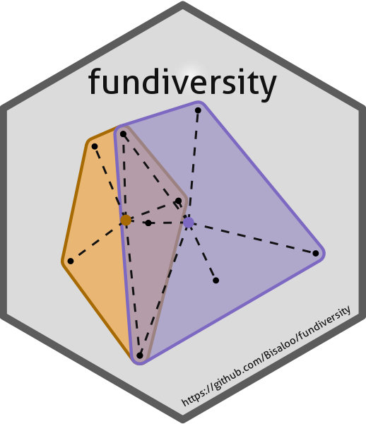

<!-- README.md is generated from README.Rmd. Please edit that file -->

# fundiversity 

<!-- badges: start -->

[](https://lifecycle.r-lib.org/articles/stages.html#maturing)
[](https://github.com/Bisaloo/fundiversity/actions)
[](https://codecov.io/gh/Bisaloo/fundiversity)
[](https://CRAN.R-project.org/package=fundiversity)
[](https://zenodo.org/badge/latestdoi/300231216)
<!-- badges: end -->

`fundiversity` provides a lightweight package to compute common
functional diversity indices. To a get a glimpse of what `fundiversity`
can do refer to the [introductory
vignette](https://bisaloo.github.io/fundiversity/articles/fundiversity.html).
The package is built using clear, public [design
principles](https://bisaloo.github.io/fundiversity/articles/design-principles.html)
inspired from our own experience and user feedback.

## Installation

You can install the stable version from CRAN with:

``` r
install.packages("fundiversity")
```

Alternatively, you can install the development version with:

``` r
install.packages("fundiversity", repos = "https://bisaloo.r-universe.dev")
```

## Examples

`fundiversity` lets you compute six functional diversity indices:
Functional Richness with `fd_fric()`, intersection with between convex
hulls with `fd_fric_intersect()`, Functional Divergence with
`fd_fdiv()`, Rao’s Quadratic Entropy with `fd_raoq()`, Functional
Dispersion with `fd_fdis()` and Functional Evenness with `fd_feve()`.
You can have a brief overview of the indices in the [introductory
vignette](https://bisaloo.github.io/fundiversity/articles/fundiversity.html).

All indices can be computed either using global trait data or at the
site-level:

``` r
library(fundiversity)

# Get trait data included in the package
data("traits_birds")

# Compute Functional Richness of all birds included
fd_fric(traits_birds)
#>   site     FRic
#> 1   s1 230967.7

# Compute Functional Divergence
fd_fdiv(traits_birds)
#>   site      FDiv
#> 1   s1 0.7282172

# Compute Rao's Quadratic Entropy
fd_raoq(traits_birds)
#>   site        Q
#> 1   s1 170.0519

# Compute Functional Dispersion
fd_fdis(traits_birds)
#>   site     FDis
#> 1   s1 146.2072

# Compute Functional Evenness
fd_feve(traits_birds)
#>   site      FEve
#> 1   s1 0.3743341
```

To compute Rao’s Quadratic Entropy, the user can also provide a distance
matrix between species directly:

``` r
dist_traits_birds = as.matrix(dist(traits_birds))

fd_raoq(traits = NULL, dist_matrix = dist_traits_birds)
#>   site        Q
#> 1   s1 170.0519
```

## Function Summary

| Function Name         | Index Name      | Parallelizable\[1\] | Memoizable\[2\] |
| :-------------------- | :-------------- | :-----------------: | :-------------: |
| `fd_fric()`           | FRic            |          ✅          |        ✅        |
| `fd_fric_intersect()` | FRic\_intersect |          ✅          |        ✅        |
| `fd_fdiv()`           | FDiv            |          ✅          |        ✅        |
| `fd_feve()`           | FEve            |          ✅          |        ❌        |
| `fd_fdis()`           | FDis            |          ✅          |        ❌        |
| `fd_raoq()`           | Rao’s Q         |          ❌          |        ❌        |

## Parallelization

Thanks to the `future.apply` package, all functions (except `fd_raoq()`)
within `fundiversity` support parallelization through the `future`
backend. To toggle parallelization follow the [`future`
syntax](https://cran.r-project.org/package=future):

``` r
future::plan(future::multisession)
fd_fdiv(traits_birds)
#>   site      FDiv
#> 1   s1 0.7282172
```

For more details please refer to the [parallelization
vignette](https://bisaloo.github.io/fundiversity/articles/parallel.html)
or use `vignette("parallel", package = "fundiversity")` within R.

## Available functional diversity indices

According to Pavoine & Bonsall (2011) classification, functional
diversity indices can be classified in three “domains” that assess
different properties of the functional space: richness, divergence, and
regularity. `fundiversity` provides function to compute indices that
assess this three facets at the site scale:

| Scale                              | Richness                                                                                                                                                                   | Divergence                                                                                                                                                                                                                                                                         | Evenness                                                                               |
| ---------------------------------- | -------------------------------------------------------------------------------------------------------------------------------------------------------------------------- | ---------------------------------------------------------------------------------------------------------------------------------------------------------------------------------------------------------------------------------------------------------------------------------- | -------------------------------------------------------------------------------------- |
| α-diversity<br />(= among sites)   | FRic with [`fd_fric()`](https://bisaloo.github.io/fundiversity/reference/fd_fric.html)                                                                                     | FDiv with [`fd_fdiv()`](https://bisaloo.github.io/fundiversity/reference/fd_fdiv.html)<br />Rao’s QE with [`fd_raoq()`](https://bisaloo.github.io/fundiversity/reference/fd_raoq.html)<br />FDis with [`fd_fdis()`](https://bisaloo.github.io/fundiversity/reference/fd_fdis.html) | FEve with [`fd_feve()`](https://bisaloo.github.io/fundiversity/reference/fd_feve.html) |
| β-diversity<br />(= between sites) | FRic pairwise intersection with [`fd_fric_intersect()`](https://bisaloo.github.io/fundiversity/reference/fd_fric_intersect.html)<br />alternatives available in `betapart` | available in `entropart`, `betapart` or `hillR`                                                                                                                                                                                                                                    | available in `BAT`                                                                     |

## Related Packages

Several other packages exist that compute functional diversity indices.
We did a [performance
comparison](https://bisaloo.github.io/fundiversity/articles/performance.html)
between related packages. We here mention some of them (but do not
mention the numerous wrappers around these packages):

| Package Name                                           | Indices included                                                                                                    | Has vignettes | Has tests | On GitHub | On CRAN (last updated)                                     |
| ------------------------------------------------------ | ------------------------------------------------------------------------------------------------------------------- | ------------- | --------- | --------- | ---------------------------------------------------------- |
| [`adiv`](https://github.com/cran/adiv)                 | Functional Entropy, Functional Redundancy                                                                           | ✅             | ❌         | ❌         |         |
| [`BAT`](https://github.com/cardosopmb/BAT)             | β-diversity indices, Richness, divergence, and evenness with hypervolumes                                           | ❌             | ❌         | ✅         |          |
| [`betapart`](https://github.com/cran/betapart)         | Functional β-diversity                                                                                              | ❌             | ❌         | ❌         |     |
| [`entropart`](https://github.com/EricMarcon/entropart) | Functional Entropy                                                                                                  | ✅             | ✅         | ✅         |    |
| [`FD`](https://github.com/cran/FD)                     | FRic, FDiv, FDis, FEve, Rao’s QE, Functional Group Richness                                                         | ❌             | ❌         | ❌         |           |
| [`hilldiv`](https://github.com/anttonalberdi/hilldiv)  | Dendrogram-based Hill numbers for functional diversity                                                              | ❌             | ❌         | ✅         |      |
| [`hillR`](https://github.com/daijiang/hillR)           | Functional Diversity Hill Numbers                                                                                   | ❌             | ✅         | ✅         |        |
| [`hypervolume`](https://github.com/cran/hypervolume)   | Hypervolume measure of functional diversity (\~FRic)                                                                | ✅             | ❌         | ✅         |  |
| [`mFD`](https://github.com/CmlMagneville/mFD)          | Functional α- and β-diversity indices, including FRic, FDiv, FDis, FEve, FIde, FMPD, FNND, FOri, FSpe, Hill Numbers | ✅             | ❌         | ✅         |          |
| [`TPD`](https://github.com/cran/TPD)                   | FRic, FDiv, FEve but for probability distributions                                                                  | ✅             | ❌         | ❌         |          |
| [`vegan`](https://github.com/vegandevs/vegan)          | Only dendrogram-based FD (`treedive()`)                                                                             | ✅             | ✅         | ✅         |        |

-----

1.  parallelization through the `future` backend please refer to the
    [parallelization
    vignette](https://bisaloo.github.io/fundiversity/articles/parallel.html)
    for details.

2.  memoization means that the results of the functions calls are cached
    and not recomputed when recalled, to toggle it off see the
    `fundiversity::fd_fric()` [Details
    section](https://bisaloo.github.io/fundiversity/reference/fd_fric.html#details).
