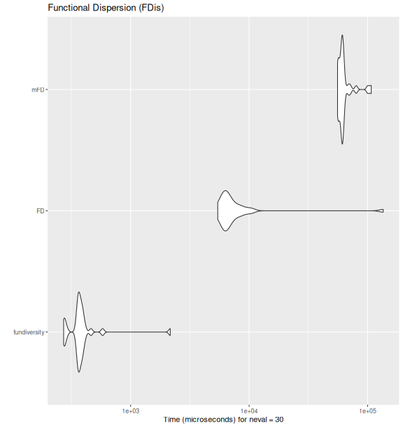
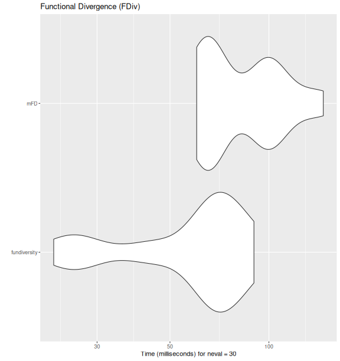
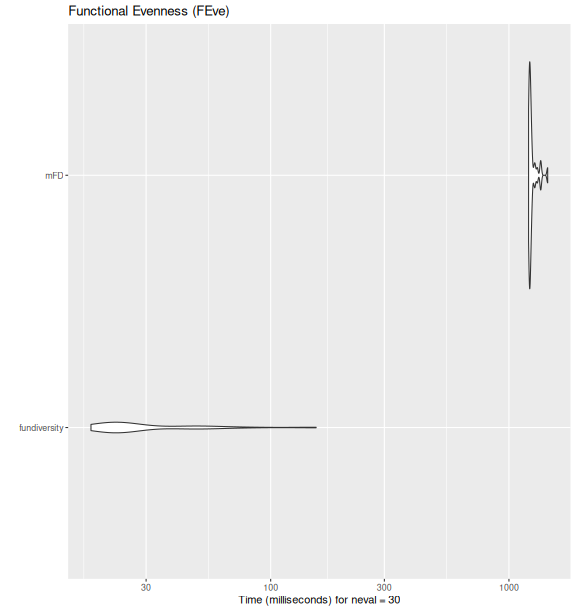
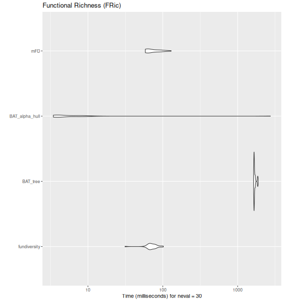
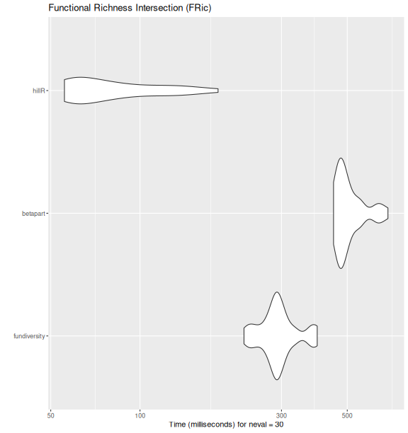
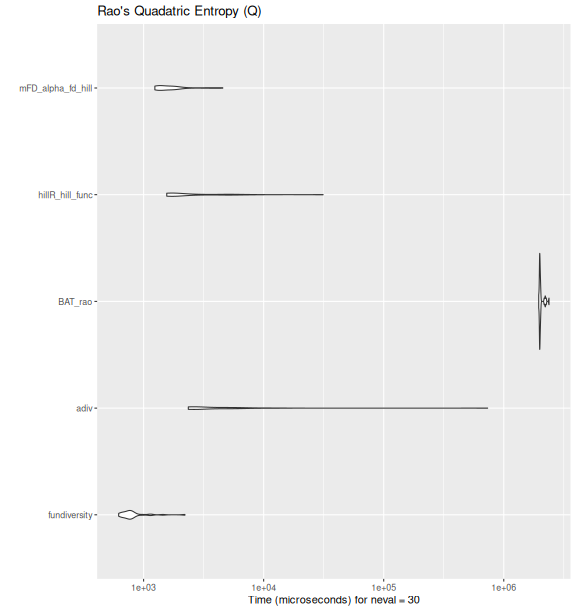

# 3. Performance Benchmark with other packages

This vignette presents some performance tests ran between `fundiversity`
and other functional diversity packages. Note that to avoid the
dependency on other packages, this vignette is
[**pre-computed**](https://ropensci.org/technotes/2019/12/08/precompute-vignettes/).

## Other packages to compute FD indices

### Main functions

Here is a table that summarizes the comparable functions (and their
arguments) for functions included in `fundiversity`. Note that the
package name is indicated before `::` followed by the function name.

[TABLE]

The other packages are thus: `adiv` (Pavoine 2020), `BAT` (Cardoso,
Rigal, and Carvalho 2015), `betapart` (Baselga and Orme 2012), `FD`
(Laliberté, Legendre, and Shipley 2014), `hillR` (Li 2018), and `mFD`
(Magneville et al. 2022). For fairness of comparison, even if
`FD::dbFD()` contains most indices we’re not considering it as it
computes all indices together for each call, and would necessarily be
slower.

### Benchmark between packages

We will now benchmark the functions included in `fundiversity` with the
corresponding function in other packages using the
`microbenchmark::microbenchmark()` function. We will use the fairly
small (~220 species, 8 sites, 4 traits) provided dataset in
`fundiversity`.

``` r
tictoc::tic()  # Time execution of vignette
library(fundiversity)
data("traits_birds", package = "fundiversity")
data("site_sp_birds", package = "fundiversity")

dist_traits_birds <- dist(traits_birds)
```

#### Functional Dispersion (FDis)

``` r
fdis_bench <- microbenchmark::microbenchmark(
  fundiversity = {
    fundiversity::fd_fdis(traits_birds, site_sp_birds)
  },
  FD = {
    FD::fdisp(dist_traits_birds, site_sp_birds)
  },
  mFD = {
    mFD::alpha.fd.multidim(
    traits_birds, site_sp_birds, ind_vect = "fdis",
    scaling = FALSE, verbose = FALSE, details_returned = FALSE
  )
  },
  times = 30
)

ggplot2::autoplot(fdis_bench) +
  labs(title = "Functional Dispersion (FDis)")
```



plot of chunk bench-fdis

#### Functional Divergence (FDiv)

``` r
fdiv_bench <- microbenchmark::microbenchmark(
  fundiversity = fd_fdiv(traits_birds, site_sp_birds),
  mFD = mFD::alpha.fd.multidim(
    traits_birds, site_sp_birds, ind_vect = "fdiv",
    scaling = FALSE, verbose = FALSE
  ),
  times = 30
)

ggplot2::autoplot(fdiv_bench) +
  labs(title = "Functional Divergence (FDiv)")
```



plot of chunk bench-fdiv

#### Functional Evenness (FEve)

``` r
feve_bench <- microbenchmark::microbenchmark(
  fundiversity = fd_feve(traits_birds, site_sp_birds),
  mFD = mFD::alpha.fd.multidim(
    traits_birds, site_sp_birds, ind_vect = "feve",
    scaling = FALSE, verbose = FALSE
  ),
  times = 30
)

ggplot2::autoplot(feve_bench) +
  labs(title = "Functional Evenness (FEve)")
```



plot of chunk bench-feve

#### Functional Richness (FRic)

``` r
fric_bench <- microbenchmark::microbenchmark(
  fundiversity = fd_fric(traits_birds, site_sp_birds),
  BAT_tree = BAT::alpha(
    site_sp_birds, traits_birds
  ),
  BAT_alpha_hull = BAT::hull.alpha(
    BAT::hull.build(site_sp_birds, traits_birds)
  ),
  mFD = mFD::alpha.fd.multidim(
    traits_birds, site_sp_birds, ind_vect = "fric",
    scaling = FALSE, verbose = FALSE
  ),
  times = 30
)

ggplot2::autoplot(fric_bench) +
  labs(title = "Functional Richness (FRic)")
```



plot of chunk bench-fric

#### Functional Richness Intersection (FRic_intersect)

``` r
fric_bench <- microbenchmark::microbenchmark(
  fundiversity  = fd_fric_intersect(traits_birds, site_sp_birds) ,
  betapart = betapart::functional.beta.pair(
    site_sp_birds, traits_birds
  ),
  hillR = hillR::hill_func_parti_pairwise(
    site_sp_birds, traits_birds, .progress = FALSE
  ),
  times = 30
)

ggplot2::autoplot(fric_bench) +
  labs(title = "Functional Richness Intersection (FRic)")
```



plot of chunk bench-fric-intersect

#### Rao’s Quadratic Entropy (Q)

``` r
raoq_bench <- fric_bench <- microbenchmark::microbenchmark(
  fundiversity = fd_raoq(traits_birds, site_sp_birds),
  adiv= adiv::QE(
    site_sp_birds, dist_traits_birds
  ),
  BAT_rao           = BAT::rao(
    site_sp_birds, distance = traits_birds
  ),
  hillR_hill_func   = hillR::hill_func(
    site_sp_birds, traits_birds, fdis = FALSE
  ),
  mFD_alpha_fd_hill = mFD::alpha.fd.hill(
    site_sp_birds, dist_traits_birds, q = 2,
    tau = "max"
  ),
  times = 30
)

ggplot2::autoplot(raoq_bench) +
  labs(title = "Rao's Quadatric Entropy (Q)")
```



plot of chunk bench-raoq

## Benchmark within `fundiversity`

We now proceed to the performance evaluation of functions within
`fundiversity` with datasets of increasing sizes.

### Increasing the number of species

``` r
make_more_sp <- function(n) {
  traits <- do.call(rbind, replicate(n, traits_birds, simplify = FALSE))
  row.names(traits) <- paste0("sp", seq_len(nrow(traits)))

  site_sp <- do.call(cbind, replicate(n, site_sp_birds, simplify = FALSE))
  colnames(site_sp) <- paste0("sp", seq_len(ncol(site_sp)))

  list(tr = traits, si = site_sp)
}

null_sp_1000   <- make_more_sp(5)
null_sp_10000  <- make_more_sp(50)
null_sp_100000 <- make_more_sp(500)
```

#### Functional Richness

``` r
bench_sp_fric <- microbenchmark::microbenchmark(
  species_200    = fd_fric(     traits_birds, site_sp_birds),
  species_1000   = fd_fric(  null_sp_1000$tr, null_sp_1000$si),
  species_10000  = fd_fric( null_sp_10000$tr, null_sp_10000$si),
  species_100000 = fd_fric(null_sp_100000$tr, null_sp_100000$si),
  times = 30
)

ggplot2::autoplot(bench_sp_fric)
```


Performance comparison of
[`fd_fric()`](https://funecology.github.io/fundiversity/reference/fd_fric.md)
with increasing number of species.

``` r
bench_sp_fric
#> Unit: milliseconds
#>            expr       min        lq      mean    median        uq        max neval
#>     species_200  64.13693  77.22506  86.41686  87.48392  95.01912  101.53571    30
#>    species_1000  19.91788  48.31584  62.22163  67.09528  78.68881   90.86103    30
#>   species_10000  54.59200  80.25405 106.29215 113.69053 123.96300  166.99047    30
#>  species_100000 705.44201 805.23353 895.93754 872.40737 950.08097 1357.15555    30
```

#### Functional Divergence

``` r
bench_sp_fdiv <- microbenchmark::microbenchmark(
  species_200    = fd_fdiv(     traits_birds, site_sp_birds),
  species_1000   = fd_fdiv(  null_sp_1000$tr, null_sp_1000$si),
  species_10000  = fd_fdiv( null_sp_10000$tr, null_sp_10000$si),
  species_100000 = fd_fdiv(null_sp_100000$tr, null_sp_100000$si),
  times = 30
)

ggplot2::autoplot(bench_sp_fdiv)
```


Performance comparison of
[`fd_fdiv()`](https://funecology.github.io/fundiversity/reference/fd_fdiv.md)
with increasing number of species.

``` r
bench_sp_fdiv
#> Unit: milliseconds
#>            expr       min        lq      mean    median        uq       max neval
#>     species_200  65.75675  82.74022  92.22989  95.55403  98.83634  113.6111    30
#>    species_1000  24.31990  71.34581  85.56509  82.23807  93.26562  258.7621    30
#>   species_10000  77.21861 100.54385 119.36332 125.36045 135.46570  150.1822    30
#>  species_100000 694.82638 789.91390 853.43494 836.83280 919.55921 1033.8374    30
```

#### Rao’s Quadratic Entropy

``` r
bench_sp_raoq <- microbenchmark::microbenchmark(
  species_200    = fd_raoq(     traits_birds, site_sp_birds),
  species_1000   = fd_raoq(  null_sp_1000$tr, null_sp_1000$si),
  species_10000  = fd_raoq( null_sp_10000$tr, null_sp_10000$si),
  times = 30
)

ggplot2::autoplot(bench_sp_raoq)
```


Performance comparison of
[`fd_raoq()`](https://funecology.github.io/fundiversity/reference/fd_raoq.md)
with increasing number of species.

``` r
bench_sp_raoq
#> Unit: microseconds
#>           expr         min          lq         mean      median          uq         max
#>    species_200     617.236     645.822     914.5668     737.549     897.623    3043.669
#>   species_1000    9534.446    9652.328   10449.2975    9774.182   10267.441   20289.876
#>  species_10000 2212780.688 2227410.464 2396306.9486 2234898.178 2507233.705 3239781.685
#>  neval
#>     30
#>     30
#>     30
```

#### Functional Evenness

``` r
bench_sp_feve <- microbenchmark::microbenchmark(
  species_200    = fd_feve(     traits_birds, site_sp_birds),
  species_1000   = fd_feve(  null_sp_1000$tr, null_sp_1000$si),
  species_10000  = fd_feve( null_sp_10000$tr, null_sp_10000$si),
  times = 15
)

ggplot2::autoplot(bench_sp_feve)
```


Performance comparison of
[`fd_feve()`](https://funecology.github.io/fundiversity/reference/fd_feve.md)
with increasing number of species.

``` r
bench_sp_feve
#> Unit: milliseconds
#>           expr        min         lq       mean     median         uq       max neval
#>    species_200   19.45845   61.86210   66.13876   70.94195   75.60393   92.3494    15
#>   species_1000   61.28659   96.18897  103.89838  111.66572  118.36332  137.2943    15
#>  species_10000 7974.82839 8187.74411 8294.13681 8273.52413 8376.39503 8759.0515    15
```

#### Comparing between indices

``` r
all_bench_sp <- list(fric = bench_sp_fric,
                     fdiv = bench_sp_fdiv,
                     raoq = bench_sp_raoq,
                     feve = bench_sp_feve) %>%
  bind_rows(.id = "fd_index") %>%
  mutate(n_sp = gsub("species_", "", expr) %>%
           as.numeric())

all_bench_sp %>%
  ggplot(aes(n_sp, time * 1e-9, color = fd_index)) +
  geom_point(alpha = 1/3) +
  geom_smooth() +
  scale_x_log10() +
  scale_y_log10() +
  scale_color_brewer(type = "qual",
                     labels = c(fric = "FRic", fdiv = "FDiv", raoq = "Rao's Q",
                                feve = "FEve")) +
  labs(title = "Performance comparison between indices",
       x = "# of species", y = "Time (in seconds)",
       color = "FD index") +
  theme_bw() +
  theme(aspect.ratio = 1)
```


Performance comparison between functions for distinct indices in
`fundiversity` with increasing number of species. Smoothed trend lines
and standard error envelopes ares shown.

### Increasing the number of sites

``` r
make_more_sites <- function(n) {
  site_sp <- do.call(rbind, replicate(n, site_sp_birds, simplify = FALSE))
  rownames(site_sp) <- paste0("s", seq_len(nrow(site_sp)))

  site_sp
}

site_sp_100   <- make_more_sites(12)
site_sp_1000  <- make_more_sites(120)
site_sp_10000 <- make_more_sites(1200)
```

#### Functional Richness

``` r
bench_sites_fric <- microbenchmark::microbenchmark(
  sites_10    = fd_fric(traits_birds, site_sp_birds),
  sites_100   = fd_fric(traits_birds, site_sp_100),
  sites_1000  = fd_fric(traits_birds, site_sp_1000),
  sites_10000 = fd_fric(traits_birds, site_sp_10000),
  times = 15
)

ggplot2::autoplot(bench_sites_fric)
```


Performance comparison of
[`fd_fric()`](https://funecology.github.io/fundiversity/reference/fd_fric.md)
with increasing number of sites.

``` r
bench_sites_fric
#> Unit: milliseconds
#>         expr        min         lq       mean     median         uq       max neval
#>     sites_10   71.68416   74.57767   86.00700   86.54204   89.98176  133.8206    15
#>    sites_100   38.16260   61.20081   75.49481   68.14976   89.16593  141.3453    15
#>   sites_1000  217.49465  259.31534  284.66718  280.32306  315.58773  339.4681    15
#>  sites_10000 2178.74594 2241.01618 2287.08006 2262.96084 2341.91784 2396.5195    15
```

#### Functional Divergence

``` r
bench_sites_fdiv <- microbenchmark::microbenchmark(
  sites_10    = fd_fdiv(traits_birds, site_sp_birds),
  sites_100   = fd_fdiv(traits_birds, site_sp_100),
  sites_1000  = fd_fdiv(traits_birds, site_sp_1000),
  sites_10000 = fd_fdiv(traits_birds, site_sp_10000),
  times = 15
)

ggplot2::autoplot(bench_sites_fdiv)
```


Performance comparison of
[`fd_fdiv()`](https://funecology.github.io/fundiversity/reference/fd_fdiv.md)
with increasing number of sites.

``` r
bench_sites_fdiv
#> Unit: milliseconds
#>         expr        min         lq       mean     median        uq       max neval
#>     sites_10   71.26430   81.32178   93.05191   92.95528  102.5015  115.5599    15
#>    sites_100   49.15161   78.18654   87.77382   98.11574  102.1231  108.4241    15
#>   sites_1000  255.95116  314.93415  334.68212  340.96382  365.8025  410.0258    15
#>  sites_10000 2442.80506 2489.52070 2563.07758 2563.32031 2603.2711 2742.8240    15
```

#### Rao’s Quadratic Entropy

``` r
bench_sites_raoq = microbenchmark::microbenchmark(
  sites_10    = fd_raoq(traits = NULL, site_sp_birds, dist_traits_birds),
  sites_100   = fd_raoq(traits = NULL, site_sp_100,   dist_traits_birds),
  sites_1000  = fd_raoq(traits = NULL, site_sp_1000,  dist_traits_birds),
  sites_10000 = fd_raoq(traits = NULL, site_sp_10000, dist_traits_birds),
  times = 15
)

ggplot2::autoplot(bench_sites_raoq)
```


Performance comparison of
[`fd_raoq()`](https://funecology.github.io/fundiversity/reference/fd_raoq.md)
with increasing number of sites.

``` r
bench_sites_raoq
#> Unit: microseconds
#>         expr        min          lq        mean     median         uq        max neval
#>     sites_10    489.460    528.4935    815.2409    544.496    634.829   3576.162    15
#>    sites_100    834.088    870.0800   1523.9049    968.512   1349.571   4322.532    15
#>   sites_1000   5510.532   5648.2775   6217.1693   5722.048   6303.896   8682.980    15
#>  sites_10000 364585.747 387482.0435 446235.0449 391929.816 401485.191 979961.408    15
```

#### Functional Evenness

``` r
bench_sites_feve <- microbenchmark::microbenchmark(
  sites_10    = fd_feve(traits = NULL, site_sp_birds, dist_traits_birds),
  sites_100   = fd_feve(traits = NULL, site_sp_100,   dist_traits_birds),
  sites_1000  = fd_feve(traits = NULL, site_sp_1000,  dist_traits_birds),
  sites_10000 = fd_feve(traits = NULL, site_sp_10000, dist_traits_birds),
  times = 15
)

ggplot2::autoplot(bench_sites_feve)
```


Performance comparison of
[`fd_feve()`](https://funecology.github.io/fundiversity/reference/fd_feve.md)
with increasing number of sites

``` r
bench_sites_feve
#> Unit: milliseconds
#>         expr        min         lq       mean     median         uq       max neval
#>     sites_10   34.80425   65.51428   75.59681   75.20675   80.92903  123.1772    15
#>    sites_100   36.21243   52.06759   67.81010   70.84707   79.89431  113.9671    15
#>   sites_1000  228.73873  272.52938  294.80104  305.90444  318.44339  343.6069    15
#>  sites_10000 2030.46418 2056.30757 2150.92871 2105.95845 2203.93375 2441.4576    15
```

#### Comparing between indices

``` r
all_bench_sites <- list(fric = bench_sites_fric,
                        fdiv = bench_sites_fdiv,
                        raoq = bench_sites_raoq,
                        feve = bench_sites_feve) %>%
  bind_rows(.id = "fd_index") %>%
  mutate(n_sites = as.numeric(gsub("sites", "", expr, fixed = TRUE)))

all_bench_sites %>%
  ggplot(aes(n_sites, time * 1e-9, color = fd_index)) +
  geom_point(alpha = 1/3) +
  geom_smooth() +
  scale_x_log10() +
  scale_y_log10() +
  scale_color_brewer(type = "qual",
                     labels = c(fric = "FRic", fdiv = "FDiv", raoq = "Rao's Q",
                                feve = "FEve")) +
  labs(title = "Performance comparison between indices",
       x = "# of sites", y = "Time (in seconds)",
       color = "FD index") +
  theme_bw() +
  theme(aspect.ratio = 1)
```


Performance comparison between functions for distinct indices in
`fundiversity` with increasing number of sites. Smoothed trend lines and
standard error envelopes ares shown.

Session info of the machine on which the benchmark was ran and time it
took to run

    #>  seconds needed to generate this document: 600.353 sec elapsed
    #> ─ Session info ────────────────────────────────────────────────────────────────────────
    #>  setting  value
    #>  version  R version 4.5.3 (2026-03-11)
    #>  os       Ubuntu 24.04.4 LTS
    #>  system   x86_64, linux-gnu
    #>  ui       Positron
    #>  language (EN)
    #>  collate  en_GB.UTF-8
    #>  ctype    en_GB.UTF-8
    #>  tz       Europe/Berlin
    #>  date     2026-03-30
    #>  pandoc   3.1.3 @ /bin/pandoc
    #>  quarto   1.9.12 @ /opt/quarto/bin/quarto
    #> 
    #> ─ Packages ────────────────────────────────────────────────────────────────────────────
    #>  package           * version    date (UTC) lib source
    #>  abind               1.4-8      2024-09-12 [1] RSPM (R 4.5.0)
    #>  ade4                1.7-24     2026-03-21 [1] RSPM
    #>  adegraphics         1.0-22     2025-04-07 [1] RSPM
    #>  adiv                2.2.1      2024-02-19 [1] RSPM
    #>  ape                 5.8-1      2024-12-16 [1] RSPM
    #>  base64enc           0.1-6      2026-02-02 [1] RSPM (R 4.5.0)
    #>  BAT                 2.11.0     2025-07-29 [1] RSPM
    #>  betapart            1.6.1      2025-07-24 [1] RSPM
    #>  bit                 4.6.0      2025-03-06 [1] RSPM (R 4.5.0)
    #>  bit64               4.6.0-1    2025-01-16 [1] CRAN (R 4.5.2)
    #>  boot                1.3-32     2025-08-29 [2] CRAN (R 4.5.3)
    #>  cachem              1.1.0      2024-05-16 [1] RSPM (R 4.5.0)
    #>  caret               7.0-1      2024-12-10 [1] RSPM
    #>  class               7.3-23     2025-01-01 [2] CRAN (R 4.5.3)
    #>  cli                 3.6.5      2025-04-23 [1] RSPM (R 4.5.0)
    #>  cluster             2.1.8.2    2026-02-05 [2] CRAN (R 4.5.3)
    #>  clusterGeneration   1.3.8      2023-08-16 [1] RSPM
    #>  coda                0.19-4.1   2024-01-31 [1] RSPM
    #>  codetools           0.2-20     2024-03-31 [2] CRAN (R 4.5.3)
    #>  combinat            0.0-8      2012-10-29 [1] RSPM
    #>  crayon              1.5.3      2024-06-20 [1] CRAN (R 4.5.2)
    #>  data.table          1.18.2.1   2026-01-27 [1] RSPM (R 4.5.0)
    #>  deldir              2.0-4      2024-02-28 [1] RSPM (R 4.5.0)
    #>  dendextend          1.19.1     2025-07-15 [1] RSPM
    #>  DEoptim             2.2-8      2022-11-11 [1] RSPM
    #>  dichromat           2.0-0.1    2022-05-02 [1] RSPM (R 4.5.0)
    #>  digest              0.6.39     2025-11-19 [1] RSPM
    #>  doParallel          1.0.17     2022-02-07 [1] RSPM (R 4.5.0)
    #>  doSNOW              1.0.20     2022-02-04 [1] RSPM
    #>  dplyr             * 1.2.0      2026-02-03 [1] RSPM (R 4.5.0)
    #>  e1071               1.7-17     2025-12-18 [1] RSPM
    #>  evaluate            1.0.5      2025-08-27 [1] RSPM (R 4.5.0)
    #>  expm                1.0-0      2024-08-19 [1] RSPM
    #>  farver              2.1.2      2024-05-13 [1] CRAN (R 4.5.2)
    #>  fastcluster         1.3.0      2025-05-07 [1] RSPM
    #>  fastmap             1.2.0      2024-05-15 [1] RSPM (R 4.5.0)
    #>  fastmatch           1.1-8      2026-01-17 [1] RSPM
    #>  FD                  1.0-12.3   2023-11-26 [1] RSPM
    #>  foreach             1.5.2      2022-02-02 [1] RSPM
    #>  fundiversity      * 1.1.1.9000 2026-03-29 [1] local
    #>  future            * 1.69.0     2026-01-16 [1] RSPM (R 4.5.0)
    #>  future.apply        1.20.2     2026-02-20 [1] RSPM (R 4.5.0)
    #>  generics            0.1.4      2025-05-09 [1] RSPM (R 4.5.0)
    #>  geometry            0.5.2      2025-02-08 [1] RSPM
    #>  ggplot2           * 4.0.2      2026-02-03 [1] RSPM (R 4.5.0)
    #>  globals             0.19.0     2026-02-02 [1] RSPM (R 4.5.0)
    #>  glue                1.8.0      2024-09-30 [1] RSPM (R 4.5.0)
    #>  gower               1.0.2      2024-12-17 [1] RSPM
    #>  gridExtra           2.3        2017-09-09 [1] RSPM
    #>  gtable              0.3.6      2024-10-25 [1] RSPM
    #>  hardhat             1.4.2      2025-08-20 [1] RSPM
    #>  hillR               0.5.2      2023-08-19 [1] RSPM
    #>  hms                 1.1.4      2025-10-17 [1] RSPM (R 4.5.0)
    #>  htmltools           0.5.9      2025-12-04 [1] RSPM
    #>  htmlwidgets         1.6.4      2023-12-06 [1] RSPM (R 4.5.0)
    #>  httr                1.4.8      2026-02-13 [1] RSPM (R 4.5.0)
    #>  hypervolume         3.1.6      2025-06-15 [1] RSPM
    #>  igraph              2.2.2      2026-02-12 [1] RSPM (R 4.5.0)
    #>  interp              1.1-6      2024-01-26 [1] RSPM
    #>  ipred               0.9-15     2024-07-18 [1] RSPM
    #>  iterators           1.0.14     2022-02-05 [1] RSPM
    #>  itertools           0.1-3      2014-03-12 [1] RSPM
    #>  jpeg                0.1-11     2025-03-21 [1] RSPM (R 4.5.0)
    #>  jsonlite            2.0.0      2025-03-27 [1] CRAN (R 4.5.2)
    #>  KernSmooth          2.23-26    2025-01-01 [2] CRAN (R 4.5.3)
    #>  knitr               1.51       2025-12-20 [1] RSPM (R 4.5.0)
    #>  ks                  1.15.1     2025-05-04 [1] RSPM
    #>  lattice             0.22-9     2026-02-09 [2] CRAN (R 4.5.3)
    #>  latticeExtra        0.6-31     2025-09-10 [1] RSPM
    #>  lava                1.8.2      2025-10-30 [1] RSPM
    #>  lifecycle           1.0.5      2026-01-08 [1] RSPM (R 4.5.0)
    #>  listenv             0.10.0     2025-11-02 [1] RSPM (R 4.5.0)
    #>  lpSolve             5.6.23     2024-12-14 [1] RSPM
    #>  lubridate           1.9.5      2026-02-04 [1] RSPM (R 4.5.0)
    #>  magic               1.6-1      2022-11-16 [1] RSPM
    #>  magrittr            2.0.4      2025-09-12 [1] RSPM (R 4.5.0)
    #>  maps                3.4.3      2025-05-26 [1] RSPM (R 4.5.0)
    #>  MASS                7.3-65     2025-02-28 [2] CRAN (R 4.5.3)
    #>  Matrix              1.7-4      2025-08-28 [2] CRAN (R 4.5.3)
    #>  mclust              6.1.2      2025-10-31 [1] RSPM
    #>  memoise             2.0.1      2021-11-26 [1] RSPM (R 4.5.0)
    #>  mFD                 1.0.7      2024-02-26 [1] RSPM
    #>  mgcv                1.9-4      2025-11-07 [1] RSPM (R 4.5.0)
    #>  microbenchmark      1.5.0      2024-09-04 [1] RSPM
    #>  minpack.lm          1.2-4      2023-09-11 [1] RSPM
    #>  mnormt              2.1.2      2026-01-27 [1] RSPM
    #>  ModelMetrics        1.2.2.2    2020-03-17 [1] RSPM
    #>  mvtnorm             1.3-5      2026-03-11 [1] RSPM
    #>  nlme                3.1-168    2025-03-31 [2] CRAN (R 4.5.3)
    #>  nls2                0.3-4      2024-07-14 [1] RSPM
    #>  nnet                7.3-20     2025-01-01 [2] CRAN (R 4.5.3)
    #>  numDeriv            2016.8-1.1 2019-06-06 [1] RSPM
    #>  optimParallel       1.0-2      2021-02-11 [1] RSPM
    #>  otel                0.2.0      2025-08-29 [1] RSPM
    #>  palmerpenguins      0.1.1      2022-08-15 [1] RSPM
    #>  parallelly          1.46.1     2026-01-08 [1] RSPM (R 4.5.0)
    #>  patchwork           1.3.2      2025-08-25 [1] RSPM
    #>  pdist               1.2.1      2022-05-02 [1] RSPM
    #>  permute             0.9-10     2026-02-06 [1] RSPM (R 4.5.0)
    #>  phangorn            2.12.1     2024-09-17 [1] RSPM
    #>  phylobase           0.8.12     2024-01-30 [1] RSPM
    #>  phytools            2.5-2      2025-09-19 [1] RSPM
    #>  picante             1.8.2      2020-06-10 [1] RSPM
    #>  pillar              1.11.1     2025-09-17 [1] RSPM (R 4.5.0)
    #>  pkgconfig           2.0.3      2019-09-22 [1] CRAN (R 4.5.2)
    #>  PlotTools           0.4.0      2026-01-29 [1] RSPM
    #>  plyr                1.8.9      2023-10-02 [1] RSPM (R 4.5.0)
    #>  png                 0.1-8      2022-11-29 [1] RSPM (R 4.5.0)
    #>  pracma              2.4.6      2025-10-22 [1] RSPM
    #>  prettyunits         1.2.0      2023-09-24 [1] CRAN (R 4.5.2)
    #>  pROC                1.19.0.1   2025-07-31 [1] RSPM
    #>  prodlim             2026.03.11 2026-03-11 [1] RSPM
    #>  progress            1.2.3      2023-12-06 [1] CRAN (R 4.5.2)
    #>  proto               1.0.0      2016-10-29 [1] RSPM
    #>  proxy               0.4-29     2025-12-29 [1] RSPM
    #>  purrr               1.2.1      2026-01-09 [1] RSPM (R 4.5.0)
    #>  quadprog            1.5-8      2019-11-20 [1] RSPM
    #>  R6                  2.6.1      2025-02-15 [1] RSPM (R 4.5.0)
    #>  rbibutils           2.4.1      2026-01-21 [1] RSPM
    #>  rcdd                1.6-1      2026-01-12 [1] RSPM
    #>  RColorBrewer        1.1-3      2022-04-03 [1] CRAN (R 4.5.2)
    #>  Rcpp                1.1.1      2026-01-10 [1] RSPM (R 4.5.0)
    #>  Rdpack              2.6.6      2026-02-08 [1] RSPM
    #>  recipes             1.3.1      2025-05-21 [1] RSPM
    #>  reshape2            1.4.5      2025-11-12 [1] RSPM (R 4.5.0)
    #>  rgl                 1.3.36     2026-03-06 [1] RSPM
    #>  rlang               1.1.7      2026-01-09 [1] RSPM (R 4.5.0)
    #>  rncl                0.8.9      2026-01-21 [1] RSPM
    #>  RNeXML              2.4.11     2023-02-01 [1] RSPM
    #>  rpart               4.1.24     2025-01-07 [2] CRAN (R 4.5.3)
    #>  S7                  0.2.1      2025-11-14 [1] RSPM
    #>  scales              1.4.0      2025-04-24 [1] RSPM (R 4.5.0)
    #>  scatterplot3d       0.3-45     2026-02-23 [1] RSPM
    #>  sessioninfo         1.2.3      2025-02-05 [1] RSPM (R 4.5.0)
    #>  snow                0.4-4      2021-10-27 [1] RSPM (R 4.5.0)
    #>  sp                  2.2-1      2026-02-13 [1] RSPM (R 4.5.0)
    #>  stringi             1.8.7      2025-03-27 [1] RSPM (R 4.5.0)
    #>  stringr             1.6.0      2025-11-04 [1] RSPM
    #>  survival            3.8-6      2026-01-16 [2] CRAN (R 4.5.3)
    #>  terra               1.9-11     2026-03-26 [1] RSPM
    #>  tibble              3.3.1      2026-01-11 [1] RSPM (R 4.5.0)
    #>  tictoc              1.2.1      2024-03-18 [1] RSPM
    #>  tidyr               1.3.2      2025-12-19 [1] RSPM
    #>  tidyselect          1.2.1      2024-03-11 [1] CRAN (R 4.5.2)
    #>  timechange          0.4.0      2026-01-29 [1] RSPM (R 4.5.0)
    #>  timeDate            4052.112   2026-01-28 [1] RSPM
    #>  TreeTools           2.2.0      2026-03-20 [1] RSPM
    #>  uuid                1.2-2      2026-01-23 [1] RSPM
    #>  vctrs               0.7.1      2026-01-23 [1] RSPM (R 4.5.0)
    #>  vegan               2.7-2      2025-10-08 [1] RSPM
    #>  viridis             0.6.5      2024-01-29 [1] RSPM
    #>  viridisLite         0.4.3      2026-02-04 [1] RSPM (R 4.5.0)
    #>  withr               3.0.2      2024-10-28 [1] CRAN (R 4.5.2)
    #>  xfun                0.56       2026-01-18 [1] RSPM (R 4.5.0)
    #>  XML                 3.99-0.22  2026-02-10 [1] RSPM (R 4.5.0)
    #>  xml2                1.5.2      2026-01-17 [1] RSPM (R 4.5.0)
    #> 
    #>  [1] /home/hgruson/.local/share/R/x86_64-pc-linux-gnu-library/4.5
    #>  [2] /opt/R/4.5.3/lib/R/library
    #>  * ── Packages attached to the search path.
    #> 
    #> ───────────────────────────────────────────────────────────────────────────────────────

## References

Baselga, Andrés, and C. David L. Orme. 2012. “Betapart: An R Package for
the Study of Beta Diversity.” *Methods in Ecology and Evolution* 3 (5):
808–12. <https://doi.org/10.1111/j.2041-210X.2012.00224.x>.

Cardoso, Pedro, François Rigal, and José C. Carvalho. 2015. “BAT
Biodiversity Assessment Tools, an R Package for the Measurement and
Estimation of Alpha and Beta Taxon, Phylogenetic and Functional
Diversity.” *Methods in Ecology and Evolution* 6 (2): 232–36.
<https://doi.org/10.1111/2041-210X.12310>.

Laliberté, Etienne, and Pierre Legendre. 2010. “A Distance-Based
Framework for Measuring Functional Diversity from Multiple Traits.”
*Ecology* 91 (1): 299–305. <https://doi.org/10.1890/08-2244.1>.

Laliberté, Etienne, Pierre Legendre, and Bill Shipley. 2014. *FD:
Measuring Functional Diversity from Multiple Traits, and Other Tools for
Functional Ecology*.

Li, Daijiang. 2018. “hillR: Taxonomic, Functional, and Phylogenetic
Diversity and Similarity Through Hill Numbers.” *Journal of Open Source
Software* 3 (31): 1041. <https://doi.org/10.21105/joss.01041>.

Magneville, Camille, Nicolas Loiseau, Camille Albouy, Nicolas Casajus,
Thomas Claverie, Arthur Escalas, Fabien Leprieur, Eva Maire, David
Mouillot, and Sébastien Villéger. 2022. “mFD: An R Package to Compute
and Illustrate the Multiple Facets of Functional Diversity.” *Ecography*
2022 (1). <https://doi.org/10.1111/ecog.05904>.

Pavoine, Sandrine. 2020. “adiv: An r Package to Analyse Biodiversity in
Ecology.” *Methods in Ecology and Evolution* 11 (9): 1106–12.
<https://doi.org/10.1111/2041-210X.13430>.

Rao, C. Radhakrishna. 1982. “Diversity and Dissimilarity Coefficients: A
Unified Approach.” *Theoretical Population Biology* 21 (1): 24–43.
<https://doi.org/10.1016/0040-5809(82)90004-1>.

Ricotta, Carlo, and Laszlo Szeidl. 2009. “Diversity Partitioning of
Rao’s Quadratic Entropy.” *Theoretical Population Biology* 76 (4):
299–302. <https://doi.org/10.1016/j.tpb.2009.10.001>.

Villéger, Sébastien, Gaël Grenouillet, and Sébastien Brosse. 2013.
“Decomposing Functional $\beta$-Diversity Reveals That Low Functional
$\beta$-Diversity Is Driven by Low Functional Turnover in European Fish
Assemblages.” *Global Ecology and Biogeography* 22 (6): 671–81.
<https://doi.org/10.1111/geb.12021>.

Villéger, Sébastien, Norman W. H. Mason, and David Mouillot. 2008. “New
Multidimensional Functional Diversity Indices for a Multifaceted
Framework in Functional Ecology.” *Ecology* 89 (8): 2290–2301.
<https://doi.org/10.1890/07-1206.1>.
