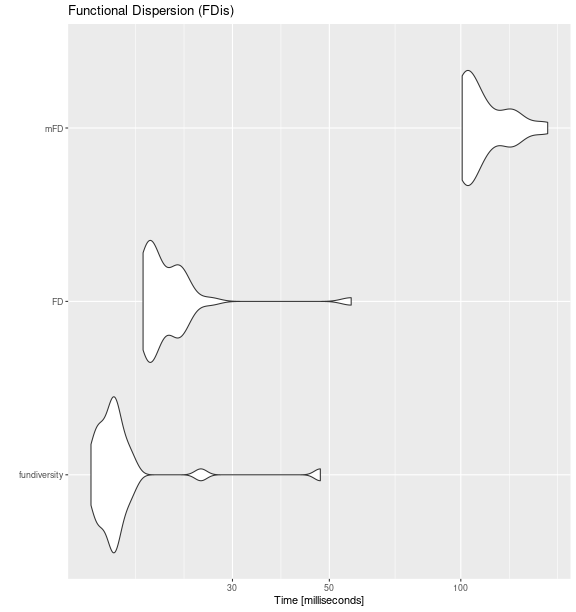
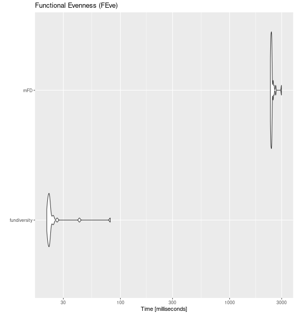
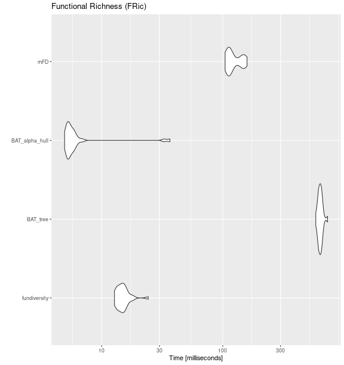

<!-- 
# Pre-render with 
knitr::knit("vignettes/_fundiversity_2-performance.Rmd", output = "vignettes/fundiversity_2-performance.Rmd")
-->


This vignette presents some performance tests ran between `fundiversity` and other functional diversity packages. Note that to avoid the dependency on other packages, this vignette is [**pre-computed**](https://ropensci.org/technotes/2019/12/08/precompute-vignettes/).

# Other packages to compute FD indices

## Main functions

Here is a table that summarizes the comparable functions (and their arguments) for functions included in `fundiversity`. Note that the package name is indicated before `::` followed by the function name.

|    Index Type    | Index Name                                        | Source                        | `fundiversity` function | Equivalent Functions |
|:-----------------|:--------------------------------------------------|:------------------------------|:------------------------|----------------------|
| α-diversity      | Functional Dispersion (FDis)                      | @Laliberte_distancebased_2010 | `fd_fdis()`             | ~~`BAT::dispersion()`~~ (doesn't compute FDis)<br />`FD::fdisp()`<br />~~`hillR::hill_func()`~~ (actually rely on `FD` for FDis computations and standardize the traits without telling the user)<br />`mFD::alpha.fd.multidim(..., ind_vect = "fdis")` |
| α-diversity      | Functional Divergence (FDiv)                      | @Villeger_New_2008            | `fd_fdiv()`             | `mFD::alpha.fd.multidim(..., ind_vect = "fdiv")`                                                                                                                                                                                                        |
| α-diversity      | Functional Evenness (FEve)                        | @Villeger_New_2008            | `fd_feve()`             | `mFD::alpha.fd.multidim(..., ind_vect = "feve")`                                                                                                                                                                                                        |
| α-diversity      | Functional Richness (FRic)                        | @Villeger_New_2008            | `fd_fric()`             | `BAT::alpha()` (tree, not strictly equal)<br />`BAT::hull.alpha()` (hull)<br />`mFD::alpha.fd.multidim(..., ind_vect = "fric")`                                                                                                                         |
| α-diversity      | Rao's Quadratic Entropy (Q)                       | @Villeger_Decomposing_2013    | `fd_raoq()`             | `adiv::QE()`<br />`BAT::rao()`<br />`hillR::hill_func()` (standardize traits without warning)<br />`mFD::alpha.fd.hill(..., q = 2, tau = "max")` (returns a slightly modified version of Q according to @Ricotta_Diversity_2009)                        |
| β-diversity      | Functional Richness Intersection (FRic_intersect) | @Rao_Diversity_1982           | `fd_fric_intersect()`   | `betapart::functional.beta.pair()`<br />`hillR::hill_func_parti_pairwise()`                                                                                                                                                                             |

The other packages are thus: `adiv` [@Pavoine_adiv_2020], `BAT` [@Cardoso_BAT_2015], `betapart` [@Baselga_betapart_2012], `FD` [@Laliberte_FD_2014], `hillR` [@Li_hillR_2018], and `mFD` [@Magneville_mFD_2022]. For fairness of comparison, even if `FD::dbFD()` contains most indices we're not considering it as it computes all indices together for each call, and would necessarily be slower.


## Benchmark between packages

We will now benchmark the functions included in `fundiversity` with the corresponding function in other packages using the `microbenchmark::microbenchmark()` function. We will use the fairly small (~220 species, 8 sites, 4 traits) provided dataset in `fundiversity`.


```r
tictoc::tic()  # Time execution of vignette
library(fundiversity)
data("traits_birds", package = "fundiversity")
data("site_sp_birds", package = "fundiversity")

dist_traits_birds <- dist(traits_birds)
```


### Functional Dispersion (FDis)


```r
fdis_bench <- microbenchmark::microbenchmark(
  fundiversity = {
    fundiversity::fd_fdis(traits_birds, site_sp_birds)
  },
  FD = {
    FD::fdisp(dist_traits_birds, site_sp_birds)
  },
  mFD = {
    mFD::alpha.fd.multidim(
    traits_birds, site_sp_birds, ind_vect = "fdis",
    scaling = FALSE, verbose = FALSE, details_returned = FALSE
  )
  },
  times = 30
)

ggplot2::autoplot(fdis_bench) +
  labs(title = "Functional Dispersion (FDis)")
```




### Functional Divergence (FDiv)


```r
fdiv_bench <- microbenchmark::microbenchmark(
  fundiversity = fd_fdiv(traits_birds, site_sp_birds),
  mFD = mFD::alpha.fd.multidim(
    traits_birds, site_sp_birds, ind_vect = "fdiv",
    scaling = FALSE, verbose = FALSE
  ),
  times = 30
)

ggplot2::autoplot(fdiv_bench) +
  labs(title = "Functional Divergence (FDiv)")
```


### Functional Evenness (FEve)


```r
feve_bench <- microbenchmark::microbenchmark(
  fundiversity = fd_feve(traits_birds, site_sp_birds),
  mFD = mFD::alpha.fd.multidim(
    traits_birds, site_sp_birds, ind_vect = "feve",
    scaling = FALSE, verbose = FALSE
  ),
  times = 30
)

ggplot2::autoplot(feve_bench) +
  labs(title = "Functional Evenness (FEve)")
```




### Functional Richness (FRic)


```r
fric_bench <- microbenchmark::microbenchmark(
  fundiversity = fd_fric(traits_birds, site_sp_birds),
  BAT_tree = BAT::alpha(
    site_sp_birds, traits_birds
  ),
  BAT_alpha_hull = BAT::hull.alpha(
    BAT::hull.build(site_sp_birds, traits_birds)
  ),
  mFD = mFD::alpha.fd.multidim(
    traits_birds, site_sp_birds, ind_vect = "fric",
    scaling = FALSE, verbose = FALSE
  ),
  times = 30
)

ggplot2::autoplot(fric_bench) +
  labs(title = "Functional Richness (FRic)")
```




### Functional Richness Intersection (FRic_intersect)


```r
fric_bench <- microbenchmark::microbenchmark(
  fundiversity  = fd_fric_intersect(traits_birds, site_sp_birds) ,
  betapart = betapart::functional.beta.pair(
    site_sp_birds, traits_birds
  ),
  hillR = hillR::hill_func_parti_pairwise(
    site_sp_birds, traits_birds, .progress = FALSE
  ),
  times = 30
)

ggplot2::autoplot(fric_bench) +
  labs(title = "Functional Richness Intersection (FRic)")
```


### Rao's Quadratic Entropy (Q)


```r
raoq_bench <- fric_bench <- microbenchmark::microbenchmark(
  fundiversity = fd_raoq(traits_birds, site_sp_birds),
  adiv= adiv::QE(
    site_sp_birds, dist_traits_birds
  ),
  BAT_rao           = BAT::rao(
    site_sp_birds, distance = traits_birds
  ),
  hillR_hill_func   = hillR::hill_func(
    site_sp_birds, traits_birds, fdis = FALSE
  ),
  mFD_alpha_fd_hill = mFD::alpha.fd.hill(
    site_sp_birds, dist_traits_birds, q = 2,
    tau = "max"
  ),
  times = 30
)

ggplot2::autoplot(raoq_bench) +
  labs(title = "Rao's Quadatric Entropy (Q)")
```


# Benchmark within `fundiversity`

We now proceed to the performance evaluation of functions within `fundiversity` with datasets of increasing sizes.

## Increasing the number of species


```r
make_more_sp <- function(n) {
  traits <- do.call(rbind, replicate(n, traits_birds, simplify = FALSE))
  row.names(traits) <- paste0("sp", seq_len(nrow(traits)))

  site_sp <- do.call(cbind, replicate(n, site_sp_birds, simplify = FALSE))
  colnames(site_sp) <- paste0("sp", seq_len(ncol(site_sp)))

  list(tr = traits, si = site_sp)
}

null_sp_1000   <- make_more_sp(5)
null_sp_10000  <- make_more_sp(50)
null_sp_100000 <- make_more_sp(500)
```

### Functional Richness


```r
bench_sp_fric <- microbenchmark::microbenchmark(
  species_200    = fd_fric(     traits_birds, site_sp_birds),
  species_1000   = fd_fric(  null_sp_1000$tr, null_sp_1000$si),
  species_10000  = fd_fric( null_sp_10000$tr, null_sp_10000$si),
  species_100000 = fd_fric(null_sp_100000$tr, null_sp_100000$si),
  times = 30
)

ggplot2::autoplot(bench_sp_fric)
```


```r
bench_sp_fric
#> Unit: milliseconds
#>            expr        min         lq       mean     median         uq        max neval  cld
#>     species_200   12.40461   12.86473   13.63794   13.65822   13.96949   15.64313    30 a   
#>    species_1000   23.31024   23.98235   24.77462   24.52898   24.99526   32.20389    30  b  
#>   species_10000  152.16972  153.69475  155.65197  154.41463  155.87235  167.39586    30   c 
#>  species_100000 1538.24210 1552.02784 1573.05390 1571.92017 1587.70159 1629.76043    30    d
```

### Functional Divergence


```r
bench_sp_fdiv <- microbenchmark::microbenchmark(
  species_200    = fd_fdiv(     traits_birds, site_sp_birds),
  species_1000   = fd_fdiv(  null_sp_1000$tr, null_sp_1000$si),
  species_10000  = fd_fdiv( null_sp_10000$tr, null_sp_10000$si),
  species_100000 = fd_fdiv(null_sp_100000$tr, null_sp_100000$si),
  times = 30
)

ggplot2::autoplot(bench_sp_fdiv)
```


```r
bench_sp_fdiv
#> Unit: milliseconds
#>            expr        min         lq       mean     median         uq        max neval cld
#>     species_200   38.18281   39.33241   41.03782   39.80735   40.19474   63.38092    30 a  
#>    species_1000   52.21140   53.58856   54.88775   54.00482   54.58979   61.12244    30 a  
#>   species_10000  215.96505  218.21261  227.32449  221.46767  231.33971  262.64920    30  b 
#>  species_100000 1996.22764 2035.16809 2090.07993 2068.75306 2097.02749 2805.37816    30   c
```

### Rao's Quadratic Entropy


```r
bench_sp_raoq <- microbenchmark::microbenchmark(
  species_200    = fd_raoq(     traits_birds, site_sp_birds),
  species_1000   = fd_raoq(  null_sp_1000$tr, null_sp_1000$si),
  species_10000  = fd_raoq( null_sp_10000$tr, null_sp_10000$si),
  times = 30
)

ggplot2::autoplot(bench_sp_raoq)
```


```r
bench_sp_raoq
#> Unit: milliseconds
#>           expr         min           lq         mean       median           uq          max neval cld
#>    species_200    1.537703     1.751935     1.954434     1.950017     2.041037     3.230497    30  a 
#>   species_1000   31.957110    34.274255    39.128452    35.156704    37.556228    66.194976    30  a 
#>  species_10000 9890.756358 10163.144236 11121.366410 11055.979331 11964.694993 13632.668874    30   b
```

### Functional Evenness


```r
bench_sp_feve <- microbenchmark::microbenchmark(
  species_200    = fd_feve(     traits_birds, site_sp_birds),
  species_1000   = fd_feve(  null_sp_1000$tr, null_sp_1000$si),
  species_10000  = fd_feve( null_sp_10000$tr, null_sp_10000$si),
  times = 15
)

ggplot2::autoplot(bench_sp_feve)
```


```r
bench_sp_feve
#> Unit: milliseconds
#>           expr         min          lq        mean      median          uq         max neval cld
#>    species_200    22.25434    23.58857    26.28398    24.66652    25.41282    49.21613    15  a 
#>   species_1000   133.12192   148.39296   167.29508   163.98844   186.30949   212.94652    15  a 
#>  species_10000 26209.90991 27553.75296 28085.39492 28186.57578 28599.03918 29311.05335    15   b
```

### Comparing between indices


```r
all_bench_sp <- list(fric = bench_sp_fric,
                     fdiv = bench_sp_fdiv,
                     raoq = bench_sp_raoq,
                     feve = bench_sp_feve) %>%
  bind_rows(.id = "fd_index") %>%
  mutate(n_sp = gsub("species_", "", expr) %>%
           as.numeric())

all_bench_sp %>%
  ggplot(aes(n_sp, time * 1e-9, color = fd_index)) +
  geom_point(alpha = 1/3) +
  geom_smooth() +
  scale_x_log10() +
  scale_y_log10() +
  scale_color_brewer(type = "qual",
                     labels = c(fric = "FRic", fdiv = "FDiv", raoq = "Rao's Q",
                                feve = "FEve")) +
  labs(title = "Performance comparison between indices",
       x = "# of species", y = "Time (in seconds)",
       color = "FD index") +
  theme_bw() +
  theme(aspect.ratio = 1)
```


## Increasing the number of sites


```r
make_more_sites <- function(n) {
  site_sp <- do.call(rbind, replicate(n, site_sp_birds, simplify = FALSE))
  rownames(site_sp) <- paste0("s", seq_len(nrow(site_sp)))

  site_sp
}

site_sp_100   <- make_more_sites(12)
site_sp_1000  <- make_more_sites(120)
site_sp_10000 <- make_more_sites(1200)
```


### Functional Richness


```r
bench_sites_fric <- microbenchmark::microbenchmark(
  sites_10    = fd_fric(traits_birds, site_sp_birds),
  sites_100   = fd_fric(traits_birds, site_sp_100),
  sites_1000  = fd_fric(traits_birds, site_sp_1000),
  sites_10000 = fd_fric(traits_birds, site_sp_10000),
  times = 15
)

ggplot2::autoplot(bench_sites_fric)
```


```r
bench_sites_fric
#> Unit: milliseconds
#>         expr        min         lq       mean     median         uq        max neval  cld
#>     sites_10   12.60195   13.45944   14.88054   13.96007   14.29602   21.66510    15 a   
#>    sites_100   45.57530   47.25923   49.87524   48.75620   52.29567   56.19952    15  b  
#>   sites_1000  372.72833  386.35628  400.43169  395.60903  408.99573  449.87164    15   c 
#>  sites_10000 3833.05136 3885.11306 3921.60544 3919.29055 3942.32492 4016.96576    15    d
```

### Functional Divergence


```r
bench_sites_fdiv <- microbenchmark::microbenchmark(
  sites_10    = fd_fdiv(traits_birds, site_sp_birds),
  sites_100   = fd_fdiv(traits_birds, site_sp_100),
  sites_1000  = fd_fdiv(traits_birds, site_sp_1000),
  sites_10000 = fd_fdiv(traits_birds, site_sp_10000),
  times = 15
)

ggplot2::autoplot(bench_sites_fdiv)
```


```r
bench_sites_fdiv
#> Unit: milliseconds
#>         expr        min         lq       mean     median         uq        max neval  cld
#>     sites_10   38.17040   39.17880   40.79484   39.59029   42.08936   45.43952    15 a   
#>    sites_100   85.09805   85.99399   94.77048   86.88365   96.33675  149.45931    15  b  
#>   sites_1000  538.76135  545.03628  582.84610  564.85683  605.87486  677.86382    15   c 
#>  sites_10000 5278.55172 5336.69296 5405.90861 5378.53730 5458.24597 5552.26594    15    d
```

### Rao's Quadratic Entropy


```r
bench_sites_raoq = microbenchmark::microbenchmark(
  sites_10    = fd_raoq(traits = NULL, site_sp_birds, dist_traits_birds),
  sites_100   = fd_raoq(traits = NULL, site_sp_100,   dist_traits_birds),
  sites_1000  = fd_raoq(traits = NULL, site_sp_1000,  dist_traits_birds),
  sites_10000 = fd_raoq(traits = NULL, site_sp_10000, dist_traits_birds),
  times = 15
)

ggplot2::autoplot(bench_sites_raoq)
```


```r
bench_sites_raoq
#> Unit: milliseconds
#>         expr          min           lq         mean       median           uq          max neval cld
#>     sites_10     1.443757     1.717630     1.887153     1.861230     2.037991     2.518933    15  a 
#>    sites_100     5.689849     6.004428     6.718675     6.178415     6.460348    13.786219    15  a 
#>   sites_1000   158.130064   158.814848   160.907719   159.296631   163.977418   166.066294    15  a 
#>  sites_10000 16296.391504 17530.369693 18080.130808 18193.538354 18411.571843 21033.249202    15   b
```

### Functional Evenness


```r
bench_sites_feve <- microbenchmark::microbenchmark(
  sites_10    = fd_feve(traits = NULL, site_sp_birds, dist_traits_birds),
  sites_100   = fd_feve(traits = NULL, site_sp_100,   dist_traits_birds),
  sites_1000  = fd_feve(traits = NULL, site_sp_1000,  dist_traits_birds),
  sites_10000 = fd_feve(traits = NULL, site_sp_10000, dist_traits_birds),
  times = 15
)

ggplot2::autoplot(bench_sites_feve)
```


```r
bench_sites_feve
#> Unit: milliseconds
#>         expr         min          lq        mean      median          uq         max neval cld
#>     sites_10    20.26885    20.79379    25.80265    21.06491    21.39182    90.92815    15 a  
#>    sites_100   113.64419   115.81009   123.60943   118.04145   123.54457   185.57582    15 a  
#>   sites_1000  1034.37573  1107.36408  1146.78358  1119.68000  1134.07348  1668.68480    15  b 
#>  sites_10000 10779.65515 10969.94333 11249.27062 11090.00824 11317.37080 12341.22800    15   c
```


### Comparing between indices


```r
all_bench_sites <- list(fric = bench_sites_fric,
                        fdiv = bench_sites_fdiv,
                        raoq = bench_sites_raoq,
                        feve = bench_sites_feve) %>%
  bind_rows(.id = "fd_index") %>%
  mutate(n_sites = gsub("sites", "", expr) %>%
           as.numeric())

all_bench_sites %>%
  ggplot(aes(n_sites, time * 1e-9, color = fd_index)) +
  geom_point(alpha = 1/3) +
  geom_smooth() +
  scale_x_log10() +
  scale_y_log10() +
  scale_color_brewer(type = "qual",
                     labels = c(fric = "FRic", fdiv = "FDiv", raoq = "Rao's Q",
                                feve = "FEve")) +
  labs(title = "Performance comparison between indices",
       x = "# of sites", y = "Time (in seconds)",
       color = "FD index") +
  theme_bw() +
  theme(aspect.ratio = 1)
```


<details>
<summary>Session info of the machine on which the benchmark was ran and time it took to run</summary>


```
#>  seconds needed to generate this document: 1691.449 sec elapsed
#> ─ Session info ─────────────────────────────────────────────────────────────────────────────────────────────────────────────────────────────────
#>  setting  value
#>  version  R version 4.2.1 (2022-06-23)
#>  os       Ubuntu 20.04.5 LTS
#>  system   x86_64, linux-gnu
#>  ui       RStudio
#>  language (EN)
#>  collate  en_US.UTF-8
#>  ctype    en_US.UTF-8
#>  tz       Etc/UTC
#>  date     2022-11-15
#>  rstudio  2022.02.0+443 Prairie Trillium (server)
#>  pandoc   2.17.1.1 @ /usr/lib/rstudio-server/bin/quarto/bin/ (via rmarkdown)
#> 
#> ─ Packages ─────────────────────────────────────────────────────────────────────────────────────────────────────────────────────────────────────
#>  package           * version    date (UTC) lib source
#>  abind               1.4-5      2016-07-21 [1] CRAN (R 4.2.0)
#>  ade4                1.7-19     2022-04-19 [1] CRAN (R 4.2.0)
#>  adegraphics         1.0-16     2021-09-16 [1] CRAN (R 4.2.1)
#>  adiv                2.2        2022-10-06 [1] CRAN (R 4.2.1)
#>  ape                 5.6-2      2022-03-02 [1] CRAN (R 4.2.0)
#>  assertthat          0.2.1      2019-03-21 [3] CRAN (R 4.1.3)
#>  base64enc           0.1-3      2015-07-28 [1] CRAN (R 4.2.1)
#>  BAT                 2.9.2      2022-11-08 [1] CRAN (R 4.2.1)
#>  betapart            1.5.6      2022-04-06 [1] CRAN (R 4.2.1)
#>  cachem              1.0.6      2021-08-19 [3] CRAN (R 4.1.3)
#>  caret               6.0-93     2022-08-09 [1] CRAN (R 4.2.1)
#>  class               7.3-20     2022-01-13 [5] CRAN (R 4.1.2)
#>  cli                 3.4.1      2022-09-23 [1] CRAN (R 4.2.1)
#>  cluster             2.1.3      2022-03-28 [5] CRAN (R 4.1.3)
#>  clusterGeneration   1.3.7      2020-12-15 [1] CRAN (R 4.2.0)
#>  coda                0.19-4     2020-09-30 [1] CRAN (R 4.2.0)
#>  codetools           0.2-18     2020-11-04 [5] CRAN (R 4.0.3)
#>  colorspace          2.0-3      2022-02-21 [1] CRAN (R 4.2.0)
#>  combinat            0.0-8      2012-10-29 [1] CRAN (R 4.2.0)
#>  crayon              1.5.1      2022-03-26 [1] CRAN (R 4.2.0)
#>  data.table          1.14.2     2021-09-27 [1] CRAN (R 4.2.0)
#>  DBI                 1.1.2      2021-12-20 [3] CRAN (R 4.1.3)
#>  deldir              1.0-6      2021-10-23 [1] CRAN (R 4.2.1)
#>  dendextend          1.16.0     2022-07-04 [1] CRAN (R 4.2.1)
#>  digest              0.6.29     2021-12-01 [1] CRAN (R 4.2.0)
#>  doParallel          1.0.17     2022-02-07 [1] CRAN (R 4.2.1)
#>  doSNOW              1.0.20     2022-02-04 [1] CRAN (R 4.2.1)
#>  dplyr             * 1.0.10     2022-09-01 [1] CRAN (R 4.2.1)
#>  e1071               1.7-12     2022-10-24 [1] CRAN (R 4.2.1)
#>  ellipsis            0.3.2      2021-04-29 [1] CRAN (R 4.2.0)
#>  evaluate            0.18       2022-11-07 [1] CRAN (R 4.2.1)
#>  expm                0.999-6    2021-01-13 [1] CRAN (R 4.2.0)
#>  fansi               1.0.3      2022-03-24 [1] CRAN (R 4.2.0)
#>  farver              2.1.0      2021-02-28 [1] CRAN (R 4.2.0)
#>  fastcluster         1.2.3      2021-05-24 [1] CRAN (R 4.2.1)
#>  fastmap             1.1.0      2021-01-25 [1] CRAN (R 4.2.1)
#>  fastmatch           1.1-3      2021-07-23 [1] CRAN (R 4.2.0)
#>  FD                  1.0-12.1   2022-05-02 [1] CRAN (R 4.2.0)
#>  foreach             1.5.2      2022-02-02 [1] CRAN (R 4.2.1)
#>  fundiversity      * 0.2.1.9000 2022-04-12 [3] Github (bisaloo/fundiversity@87652ba)
#>  future              1.28.0     2022-09-02 [1] CRAN (R 4.2.1)
#>  future.apply        1.10.0     2022-11-05 [1] CRAN (R 4.2.1)
#>  generics            0.1.2      2022-01-31 [1] CRAN (R 4.2.0)
#>  geometry            0.4.6      2022-04-18 [1] CRAN (R 4.2.0)
#>  ggplot2           * 3.3.6      2022-05-03 [1] CRAN (R 4.2.0)
#>  globals             0.16.1     2022-08-28 [1] CRAN (R 4.2.1)
#>  glue                1.6.2      2022-02-24 [1] CRAN (R 4.2.0)
#>  gower               1.0.0      2022-02-03 [1] CRAN (R 4.2.1)
#>  gridExtra           2.3        2017-09-09 [1] CRAN (R 4.2.1)
#>  gtable              0.3.0      2019-03-25 [1] CRAN (R 4.2.0)
#>  hardhat             1.2.0      2022-06-30 [1] CRAN (R 4.2.1)
#>  here                1.0.1      2020-12-13 [3] CRAN (R 4.1.3)
#>  highr               0.9        2021-04-16 [1] CRAN (R 4.2.1)
#>  hillR               0.5.1      2021-03-02 [1] CRAN (R 4.2.0)
#>  hms                 1.1.1      2021-09-26 [1] CRAN (R 4.2.0)
#>  htmltools           0.5.3      2022-07-18 [1] CRAN (R 4.2.1)
#>  htmlwidgets         1.5.4      2021-09-08 [1] CRAN (R 4.2.1)
#>  httr                1.4.4      2022-08-17 [1] CRAN (R 4.2.1)
#>  hypervolume         3.0.4      2022-05-28 [1] CRAN (R 4.2.1)
#>  igraph              1.3.2      2022-06-13 [1] CRAN (R 4.2.0)
#>  interp              1.1-3      2022-07-13 [1] CRAN (R 4.2.1)
#>  ipred               0.9-13     2022-06-02 [1] CRAN (R 4.2.1)
#>  iterators           1.0.14     2022-02-05 [1] CRAN (R 4.2.1)
#>  itertools           0.1-3      2014-03-12 [1] CRAN (R 4.2.1)
#>  jpeg                0.1-9      2021-07-24 [1] CRAN (R 4.2.1)
#>  jsonlite            1.8.3      2022-10-21 [1] CRAN (R 4.2.1)
#>  KernSmooth          2.23-20    2021-05-03 [5] CRAN (R 4.0.5)
#>  knitr               1.40       2022-08-24 [1] CRAN (R 4.2.1)
#>  ks                  1.13.5     2022-04-14 [1] CRAN (R 4.2.1)
#>  lattice             0.20-45    2021-09-22 [3] CRAN (R 4.1.3)
#>  latticeExtra        0.6-30     2022-07-04 [1] CRAN (R 4.2.1)
#>  lava                1.7.0      2022-10-25 [1] CRAN (R 4.2.1)
#>  lifecycle           1.0.3      2022-10-07 [1] CRAN (R 4.2.1)
#>  listenv             0.8.0      2019-12-05 [1] CRAN (R 4.2.1)
#>  lpSolve             5.6.15     2020-01-24 [1] CRAN (R 4.2.0)
#>  lubridate           1.9.0      2022-11-06 [1] CRAN (R 4.2.1)
#>  magic               1.6-0      2022-02-09 [1] CRAN (R 4.2.0)
#>  magrittr            2.0.3      2022-03-30 [1] CRAN (R 4.2.0)
#>  maps                3.4.0      2021-09-25 [1] CRAN (R 4.2.0)
#>  MASS                7.3-58.1   2022-08-03 [3] CRAN (R 4.2.1)
#>  Matrix              1.4-1      2022-03-23 [3] CRAN (R 4.1.3)
#>  mclust              6.0.0      2022-10-31 [1] CRAN (R 4.2.1)
#>  memoise             2.0.1      2021-11-26 [3] CRAN (R 4.1.3)
#>  mFD                 1.0.2      2022-11-08 [1] CRAN (R 4.2.1)
#>  mgcv                1.8-40     2022-03-29 [5] CRAN (R 4.1.3)
#>  microbenchmark      1.4.9      2021-11-09 [3] CRAN (R 4.1.3)
#>  mnormt              2.1.0      2022-06-07 [1] CRAN (R 4.2.0)
#>  ModelMetrics        1.2.2.2    2020-03-17 [1] CRAN (R 4.2.1)
#>  multcomp            1.4-19     2022-04-26 [1] CRAN (R 4.2.0)
#>  munsell             0.5.0      2018-06-12 [1] CRAN (R 4.2.0)
#>  mvtnorm             1.1-3      2021-10-08 [1] CRAN (R 4.2.0)
#>  nlme                3.1-159    2022-08-09 [3] CRAN (R 4.2.1)
#>  nls2                0.3-3      2022-05-02 [1] CRAN (R 4.2.1)
#>  nnet                7.3-17     2022-01-13 [5] CRAN (R 4.1.2)
#>  numDeriv            2016.8-1.1 2019-06-06 [1] CRAN (R 4.2.0)
#>  palmerpenguins      0.1.1      2022-08-15 [1] CRAN (R 4.2.1)
#>  parallelly          1.32.1     2022-07-21 [1] CRAN (R 4.2.1)
#>  patchwork           1.1.2      2022-08-19 [1] CRAN (R 4.2.1)
#>  pdist               1.2.1      2022-05-02 [1] CRAN (R 4.2.1)
#>  permute             0.9-7      2022-01-27 [1] CRAN (R 4.2.0)
#>  phangorn            2.9.0      2022-06-16 [1] CRAN (R 4.2.0)
#>  phylobase           0.8.10     2020-03-01 [1] CRAN (R 4.2.1)
#>  phytools            1.0-3      2022-04-05 [1] CRAN (R 4.2.0)
#>  picante             1.8.2      2020-06-10 [1] CRAN (R 4.2.1)
#>  pillar              1.7.0      2022-02-01 [1] CRAN (R 4.2.0)
#>  pkgconfig           2.0.3      2019-09-22 [1] CRAN (R 4.2.0)
#>  plotrix             3.8-2      2021-09-08 [1] CRAN (R 4.2.0)
#>  plyr                1.8.7      2022-03-24 [1] CRAN (R 4.2.0)
#>  png                 0.1-7      2013-12-03 [1] CRAN (R 4.2.1)
#>  pracma              2.4.2      2022-09-22 [1] CRAN (R 4.2.1)
#>  prettyunits         1.1.1      2020-01-24 [1] CRAN (R 4.2.0)
#>  pROC                1.18.0     2021-09-03 [1] CRAN (R 4.2.1)
#>  prodlim             2019.11.13 2019-11-17 [1] CRAN (R 4.2.1)
#>  progress            1.2.2      2019-05-16 [1] CRAN (R 4.2.0)
#>  proto               1.0.0      2016-10-29 [1] CRAN (R 4.2.1)
#>  proxy               0.4-27     2022-06-09 [1] CRAN (R 4.2.1)
#>  purrr               0.3.4      2020-04-17 [1] CRAN (R 4.2.0)
#>  quadprog            1.5-8      2019-11-20 [1] CRAN (R 4.2.0)
#>  R6                  2.5.1      2021-08-19 [1] CRAN (R 4.2.0)
#>  raster              3.6-3      2022-09-18 [1] CRAN (R 4.2.1)
#>  rcdd                1.5        2021-11-18 [1] CRAN (R 4.2.1)
#>  RColorBrewer        1.1-3      2022-04-03 [1] CRAN (R 4.2.0)
#>  Rcpp                1.0.8.3    2022-03-17 [1] CRAN (R 4.2.0)
#>  recipes             1.0.3      2022-11-09 [1] CRAN (R 4.2.1)
#>  reshape2            1.4.4      2020-04-09 [1] CRAN (R 4.2.1)
#>  rgeos               0.5-9      2021-12-15 [1] CRAN (R 4.2.1)
#>  rgl                 0.110.2    2022-09-26 [1] CRAN (R 4.2.1)
#>  rlang               1.0.6      2022-09-24 [1] CRAN (R 4.2.1)
#>  rmarkdown           2.13       2022-03-10 [3] CRAN (R 4.1.3)
#>  rncl                0.8.6      2022-03-18 [1] CRAN (R 4.2.1)
#>  RNeXML              2.4.8      2022-10-19 [1] CRAN (R 4.2.1)
#>  rpart               4.1.16     2022-01-24 [5] CRAN (R 4.1.2)
#>  rprojroot           2.0.3      2022-04-02 [1] CRAN (R 4.2.1)
#>  rstudioapi          0.14       2022-08-22 [1] CRAN (R 4.2.1)
#>  sandwich            3.0-2      2022-06-15 [1] CRAN (R 4.2.0)
#>  scales              1.2.0      2022-04-13 [1] CRAN (R 4.2.0)
#>  scatterplot3d       0.3-41     2018-03-14 [1] CRAN (R 4.2.0)
#>  sessioninfo         1.2.2      2021-12-06 [3] CRAN (R 4.1.3)
#>  snow                0.4-4      2021-10-27 [1] CRAN (R 4.2.1)
#>  sp                  1.5-0      2022-06-05 [1] CRAN (R 4.2.0)
#>  stringi             1.7.6      2021-11-29 [1] CRAN (R 4.2.0)
#>  stringr             1.4.0      2019-02-10 [1] CRAN (R 4.2.0)
#>  survival            3.3-1      2022-03-03 [3] CRAN (R 4.1.3)
#>  terra               1.6-17     2022-09-10 [1] CRAN (R 4.2.1)
#>  TH.data             1.1-1      2022-04-26 [1] CRAN (R 4.2.0)
#>  tibble              3.1.7      2022-05-03 [1] CRAN (R 4.2.0)
#>  tictoc              1.0.1      2021-04-19 [3] CRAN (R 4.1.3)
#>  tidyr               1.2.1      2022-09-08 [1] CRAN (R 4.2.1)
#>  tidyselect          1.2.0      2022-10-10 [1] CRAN (R 4.2.1)
#>  timechange          0.1.1      2022-11-04 [1] CRAN (R 4.2.1)
#>  timeDate            4021.106   2022-09-30 [1] CRAN (R 4.2.1)
#>  utf8                1.2.2      2021-07-24 [1] CRAN (R 4.2.0)
#>  uuid                1.1-0      2022-04-19 [1] CRAN (R 4.2.1)
#>  vctrs               0.5.0      2022-10-22 [1] CRAN (R 4.2.1)
#>  vegan               2.6-2      2022-04-17 [1] CRAN (R 4.2.0)
#>  viridis             0.6.2      2021-10-13 [1] CRAN (R 4.2.1)
#>  viridisLite         0.4.0      2021-04-13 [1] CRAN (R 4.2.0)
#>  withr               2.5.0      2022-03-03 [1] CRAN (R 4.2.0)
#>  xfun                0.34       2022-10-18 [1] CRAN (R 4.2.1)
#>  XML                 3.99-0.12  2022-10-28 [1] CRAN (R 4.2.1)
#>  xml2                1.3.3      2021-11-30 [1] CRAN (R 4.2.1)
#>  yaml                2.3.6      2022-10-18 [1] CRAN (R 4.2.1)
#>  zoo                 1.8-10     2022-04-15 [1] CRAN (R 4.2.0)
#> 
#>  [1] /home/ke76dimu/R-library/4.2
#>  [2] /usr/local/lib/R/site-library
#>  [3] /data/library/4.1
#>  [4] /usr/lib/R/site-library
#>  [5] /usr/lib/R/library
#> 
#> ────────────────────────────────────────────────────────────────────────────────────────────────────────────────────────────────────────────────
```

</details>

# References


